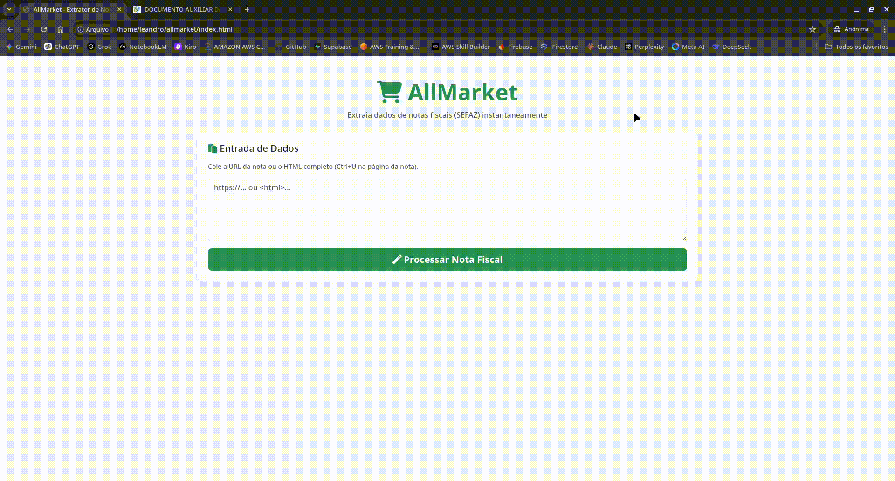

# 🛒 AllMarket - Sistema de Gestão de Compras

O **AllMarket** é uma API robusta desenvolvida em Go, projetada para gerenciar, validar e extrair dados de compras a partir de notas fiscais eletrônicas (NFC-e). O projeto utiliza padrões de arquitetura modernos para garantir escalabilidade e alta performance no processamento de dados fiscais.

## 📺 Demonstração

> **Status do Projeto:** MVP Funcional - Extrator Multiestadual 🚀

<p align="center">
  
</p>

---

## 🛠️ Tecnologias e Ferramentas

* **Linguagem:** Go (Golang) v1.22+.
* **Framework Web:** [Gin Gonic](https://www.google.com/search?q=https://gin-gonic.com/) para roteamento eficiente e alta performance.
* **Web Scraping:** [GoQuery](https://www.google.com/search?q=https://github.com/PuerkitoBio/goquery) para parsing de HTML e XML da SEFAZ.
* **Frontend:** HTML5, CSS3 (Bootstrap 5) e JavaScript Assíncrono (Fetch API).
* **Arquitetura:** Clean Architecture para separação de responsabilidades.

---

## 🏗️ Estrutura do Projeto (Clean Architecture)

O projeto está organizado seguindo os princípios da arquitetura limpa, dividindo a lógica em camadas independentes:

* **`cmd/api/`**: Ponto de entrada da aplicação. Configura o servidor HTTP, middlewares de CORS e as rotas da API.
* **`internal/entity/`**: Contém os modelos de domínio (`NotaFiscal`, `Item`, `Estabelecimento`) e as regras de negócio essenciais, como o cálculo de totais.
* **`internal/usecase/`**: Camada de regras de aplicação. Contém os scrapers especializados para diferentes estados e a lógica de orquestração do processamento.

---

## 🚀 Funcionalidades Atuais

* **Processamento Híbrido:** Suporte para extração de dados via URL direta ou colagem de código-fonte HTML/XML.
* **Suporte Multiestadual:** Scrapers configurados para os padrões de Santa Catarina (SC), Pernambuco (PE) e Paraíba (PB).
* **Normalização de Dados:** Tratamento automático de formatos de data (RFC3339) e conversão de valores monetários e quantidades.
* **Interface Responsiva:** Painel visual que exibe detalhes do estabelecimento (CNPJ, Nome), chave de acesso e tabela detalhada de produtos.
* **Cálculo de Integridade:** Validação interna do valor total da nota com base na soma dos itens processados.

---

## 🧪 Como Testar

1. Certifique-se de ter o **Go** instalado em sua máquina.
2. Inicie o servidor backend:
```bash
go run cmd/api/main.go

```


3. Abra o arquivo `index.html` em qualquer navegador moderno.
4. Copie uma URL de consulta de NFC-e (ex: SEFAZ-PE) e clique em **"Processar Nota Fiscal"**.

---

### 📈 Próximos Passos

* [ ] Integração com **Firebase Auth** para gestão de usuários.
* [ ] Persistência de dados no **Google Cloud Firestore**.
* [ ] Dashboards de comparação de preços e histórico de gastos.

---

**Desenvolvido com foco em performance e qualidade de código por Leandro.**

---
