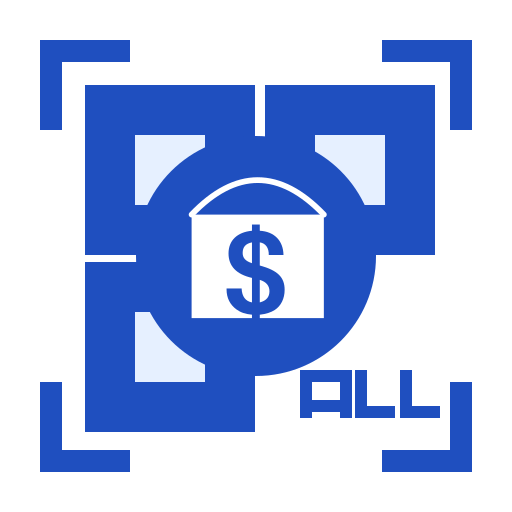
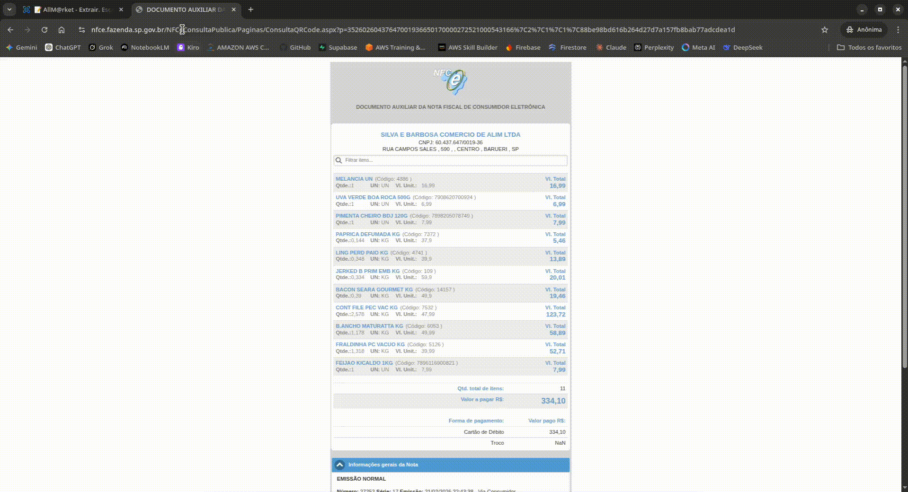

#  AllM@rket 
> **Extraia • Escaneie • Economize**

O **AllM@rket** é uma solução inteligente para gestão de consumo pessoal. Ele automatiza a extração de dados de notas fiscais via QR Code, transformando cupons fiscais complexos em um histórico de compras limpo, detalhado e útil.

## ✨ Demonstração


---

## ✨ O Conceito 3E
O AllM@rket foi construído sobre três pilares fundamentais que guiam a experiência do usuário:

* **Extraia:** Esqueça a digitação manual. Cole o link da nota e deixe o processamento por nossa conta.
* **Escaneie:** Inteligência que organiza cada item, preço unitário e estabelecimento automaticamente.
* **Economize:** Transforme dados brutos em economia real através de um histórico inteligente.

---

## 🚀 Tecnologias
Este projeto utiliza uma stack moderna focada em performance e interface minimalista:

* **Backend:** [Go](https://golang.org/) (Golang) - Processamento robusto e alta performance.
* **Frontend:** Tailwind CSS & JavaScript Vanilla - UI fluida, responsiva e leve.
* **Auth:** Google Identity Services - Autenticação segura e *one-tap login*.
* **Infra:** Arquitetura RESTful com deploy automatizado no Render.

---

## 🛠️ Como Funciona?
O fluxo foi desenhado para ser **simples, rápido e automático**:

1.  **Login:** Acesse instantaneamente com sua conta Google.
2.  **Input:** Cole a URL do QR Code da sua Nota Fiscal (SEFAZ).
3.  **Processamento:** Nossa API em Go faz o *parsing* do HTML em milissegundos.
4.  **Resultado:** Os itens são organizados em cards detalhados com soma total automática.

---

## 📱 Mobile First
O AllM@rket foi desenhado sob a filosofia **Mobile-First**. A interface se adapta perfeitamente ao seu smartphone, permitindo que você registre suas compras e controle seus gastos antes mesmo de sair do mercado.

---

## 🔧 Instalação & Uso Local

```bash
# 1. Clone o repositório
git clone [https://github.com/seu-usuario/allmarket.git](https://github.com/seu-usuario/allmarket.git)

# 2. Inicie o Backend (Go)
cd server
go run main.go

# 3. Frontend
# Basta abrir o index.html (recomenda-se o uso de Live Server)

---

## 📝 Roadmap de Evolução

* [ ] Comparativo de preços entre estabelecimentos.
* [ ] Gráficos de categorias de consumo (Alimentação, Limpeza, etc.).
* [ ] Lista de compras automática baseada no histórico.
* [ ] Suporte a notas fiscais de outros estados.

---

## 🤝 Contribuições

Contribuições são o que fazem a comunidade open source um lugar incrível. Sinta-se à vontade para abrir uma **Issue** ou enviar um **Pull Request**.


